# Wellnest

A comprehensive care management application for tracking health information, medications, appointments, and other important details for loved ones in assisted living.

## Features

### Core Functionality
- **Multiple Profiles**: Manage care information for multiple people
- **Medications**: Track medications with dosage, frequency, prescribing doctor, pharmacy, and notes
  - **Photo Import** (Optional): Import medications from photos using Claude vision API
    - Take a photo of a medication list printout → AI extracts all medications
    - Automatically populates drug names, dosages, frequencies, prescribing doctors, etc.
    - ~$0.004 per photo (~less than a penny for a 3-page medication list)
    - Requires Claude API key (see AI setup section below)
- **Appointments**: Schedule appointments with date/time, location, and reminder notifications
- **Staff Contacts**: Store contact information for facility staff and caregivers
- **Health Profile**: Record vital health information including:
  - Height, weight, blood type
  - Allergies and medical conditions
  - Emergency contact information
- **Insurance Management**: Track insurance policies with:
  - Separate provider database for easy reuse
  - Policy numbers, member and provider phone numbers
  - Coverage type (PPO, HMO, etc.) and insurance type (Medical, Dental, Medicare, etc.)
  - Photo storage for insurance card front/back
- **Security Codes**: Store access codes for facility doors, rooms, etc.
- **Room Information**: Track room dimensions and details:
  - Room length, width, and ceiling height
  - Window dimensions for drapes/curtains
  - Room notes for additional details
  - Perfect for furniture shopping and planning
- **Supply Tracking**: Simple consumables tracker:
  - Track items that need regular replenishing (milk, snacks, etc.)
  - Last replenished date tracking
  - Quick "Mark as Replenished" button
  - No alerts - just a reference list
- **Message Clarification** (Optional): AI-powered message clarification for hard-to-read text messages:
  - Helps understand garbled or fragmented messages from loved ones with vision problems
  - Bring Your Own Key (BYOK) - users provide their own Claude API key
  - Secure encrypted storage for API keys (AES256-GCM with hardware-backed encryption)
  - Uses Claude Haiku model (~$0.0002 per message, ~25,000 messages on free tier)
  - Shows clarified messages by default in the messages list
  - Completely optional - app works fully without this feature
  - Privacy-focused: your API key only communicates with Claude API

### UI Features
- **6 Color Themes**: Teal, Purple, Blue, Green, Orange, Pink (with light/dark mode support)
- **Theme Persistence**: Selected theme is saved to database
- **Material Design 3**: Modern, clean interface
- **Intuitive Navigation**: Easy access to all features from main menu

## Architecture

- **Language**: Kotlin
- **UI Framework**: Jetpack Compose
- **Architecture Pattern**: MVVM (Model-View-ViewModel)
- **Database**: Room (SQLite) version 7 with the following entities:
  - Profile (with room dimension fields)
  - Medication
  - Appointment
  - Contact
  - HealthProfile
  - InsuranceProvider
  - InsurancePolicy (with photo URI fields)
  - SecurityCode
  - Supply
  - Message (with original and clarified text)
  - Settings (with last selected profile and theme preference)
- **State Management**: StateFlow for reactive UI updates
- **Navigation**: Jetpack Compose Navigation

## Setting Up AI Features (Optional)

Wellnest includes optional AI-powered features using Claude API. These are completely optional but can significantly streamline data entry and help understand hard-to-read messages.

**AI Features:**
- **Medication Photo Import**: Extract medication information from photos of medication lists
- **Message Clarification**: Understand hard-to-read messages from loved ones with vision problems

Both features use your own Claude API key for privacy and cost control.

### Getting a Free Claude API Key

1. Visit [console.anthropic.com](https://console.anthropic.com)
2. Sign up for a free account (no credit card required)
3. Navigate to **API Keys** in the console
4. Click **Create Key** and copy your API key
5. In the Wellnest app, go to **Settings** → **AI Message Clarification**
6. Toggle on "Enable AI Clarification"
7. Paste your API key and tap **Test Connection** to verify it works

**Free Tier Details:**
- New accounts receive **$5 in free credit**
- **Message clarification**: ~$0.0002 per message (25,000 messages with free credit)
- **Medication photo import**: ~$0.004 per photo (1,250 medication lists with free credit)
- No credit card required to get started
- Credit expires after a few months, but you can add payment details if needed

**Privacy:** Your API key is stored encrypted on your device using hardware-backed AES256-GCM encryption. When using AI features, only the relevant content (message text or medication photo) and your API key are sent to Claude API - no other personal information is transmitted.

## Building the Project

### Requirements
- Android Studio (latest version recommended)
- JDK 17 or later
- Android SDK with API 24+ (minimum) and API 36 (target)

### Build Instructions

1. Open the project in Android Studio
2. Wait for Gradle sync to complete
3. Run the app on an emulator or physical device

Or use the command line (requires JAVA_HOME to be set):
```bash
./gradlew assembleDebug
```

The APK will be generated in:
```
app/build/outputs/apk/debug/app-debug.apk
```

## Database Schema

All entities use foreign keys with cascade delete to maintain referential integrity. When a Profile is deleted, all associated data (medications, appointments, etc.) are automatically deleted.

### Key Relationships
- Profile (1) → (many) Medications
- Profile (1) → (many) Appointments
- Profile (1) → (many) Contacts
- Profile (1) → (one) HealthProfile
- Profile (1) → (many) InsurancePolicies
- Profile (1) → (many) SecurityCodes
- Profile (1) → (many) Supplies
- Profile (1) → (many) Messages
- InsuranceProvider (1) → (many) InsurancePolicies

### Database Migrations
The database uses explicit migrations to preserve user data across schema changes:
- v2→v3: Added insurance card photo fields
- v3→v4: Added room dimension fields to profiles
- v4→v5: Created supplies table
- v5→v6: Added lastSelectedProfileId to settings (persists profile selection across app restarts)
- v6→v7: Created messages table for message clarification feature

## Screenshots

### Profile Selection
Choose which loved one's information to view and manage.

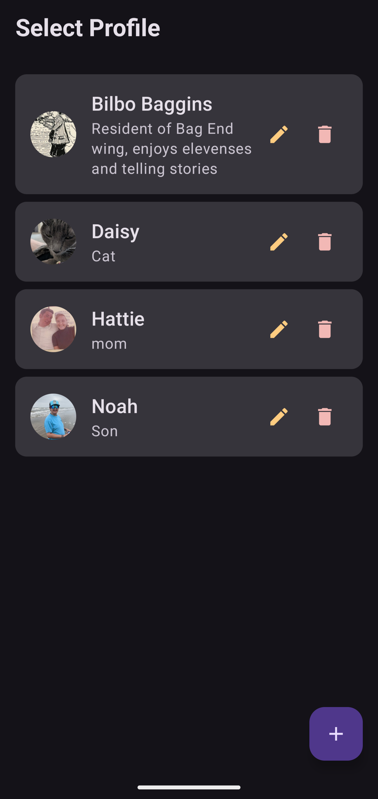

### Main Dashboard
Quick access to all features from a clean, organized home screen.

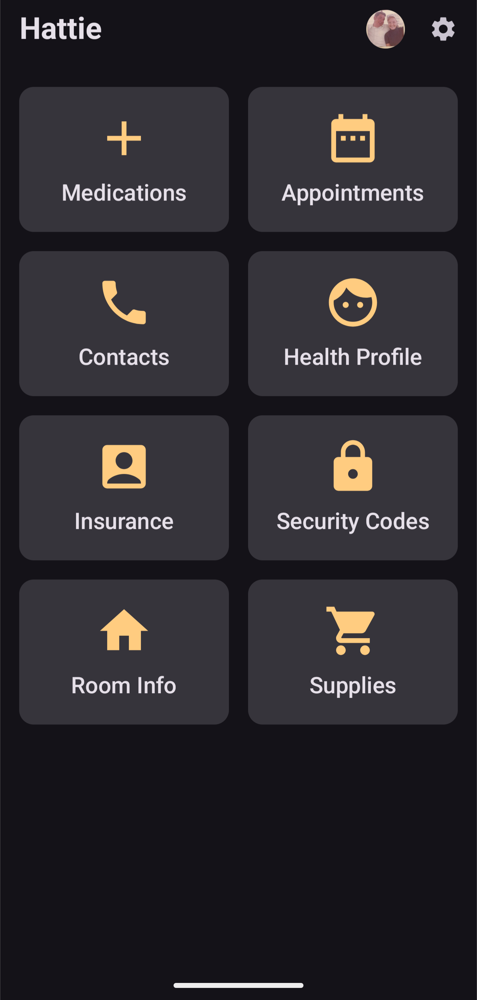

### Medications
Track all medications with dosage, frequency, prescribing doctor, and pharmacy information.

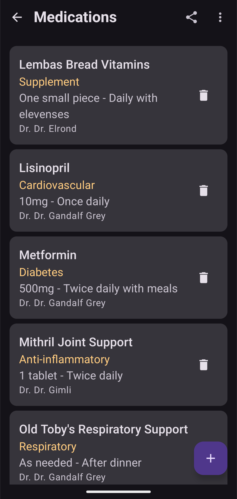

### Medication Photo Import
Import medications from photos using Claude vision API - automatically extracts all medication details.

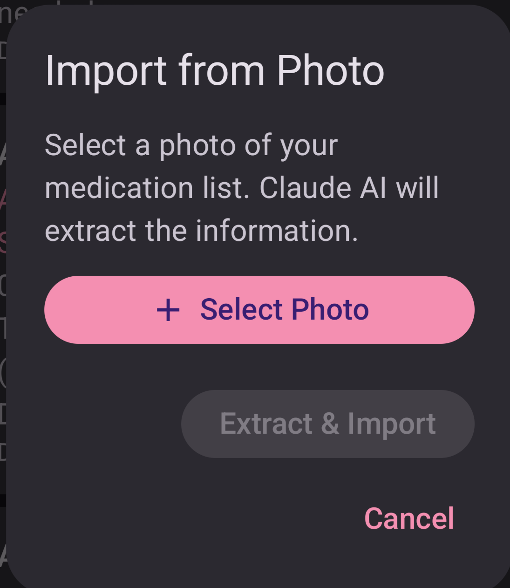

### Appointments
Keep track of upcoming appointments with date, time, location, and notes.

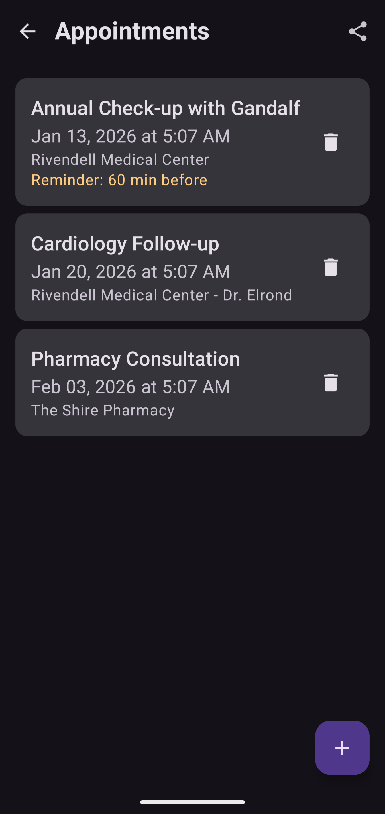

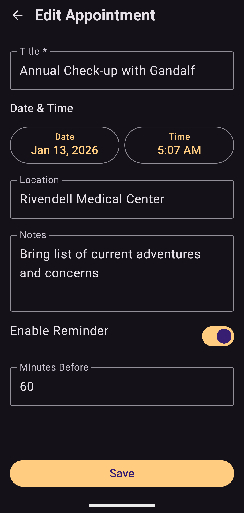

### Staff & Caregiver Contacts
Store contact information for facility staff, doctors, and caregivers.

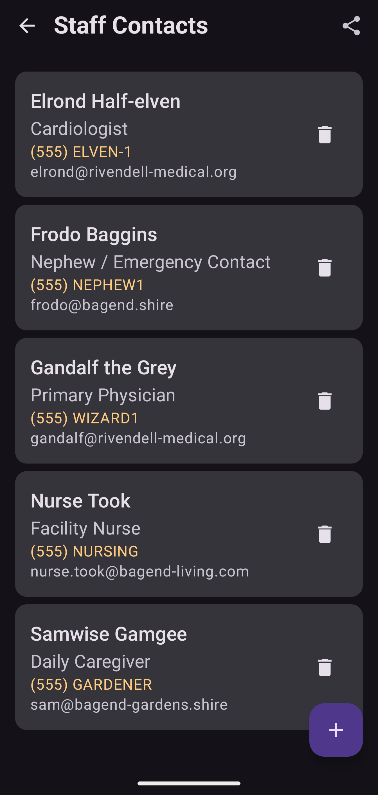

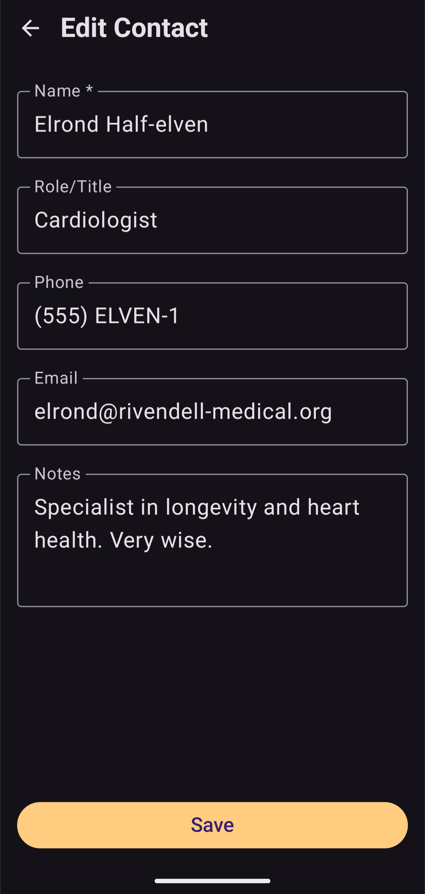

### Health Profile
Record vital health information including allergies, medical conditions, and emergency contacts.

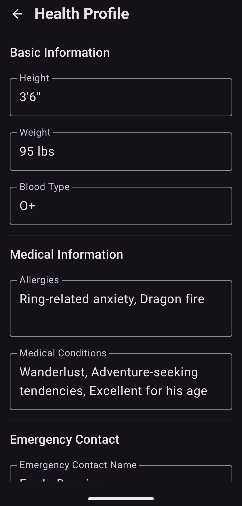

### Insurance Information
Manage insurance policies with provider details, policy numbers, and card photos.

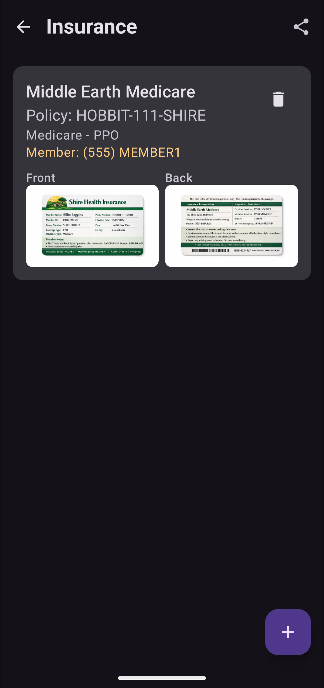

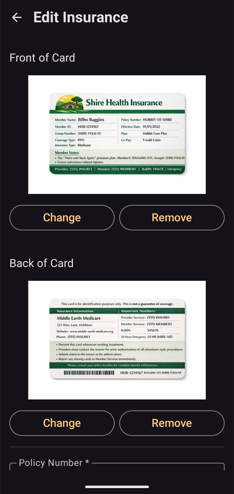

### Room Information
Track room dimensions for furniture shopping, including window measurements for drapes.

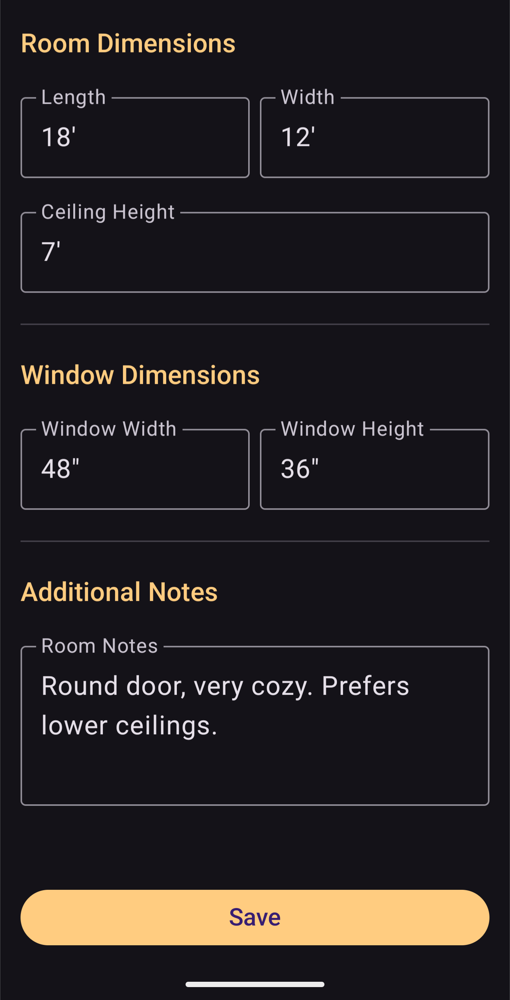

### Supply Tracking
Keep track of consumables that need regular replenishing like milk, snacks, and personal items.

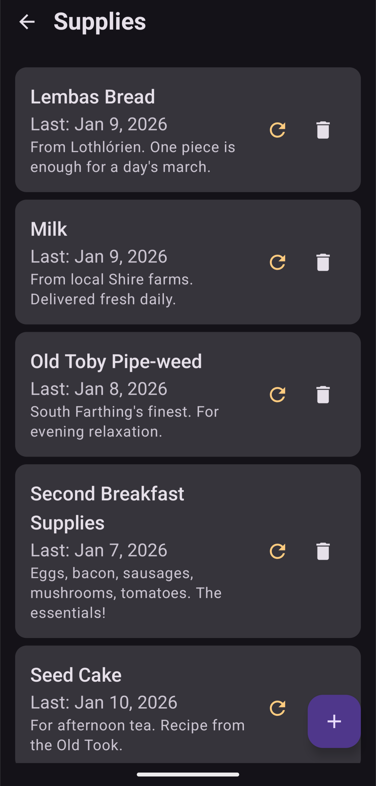

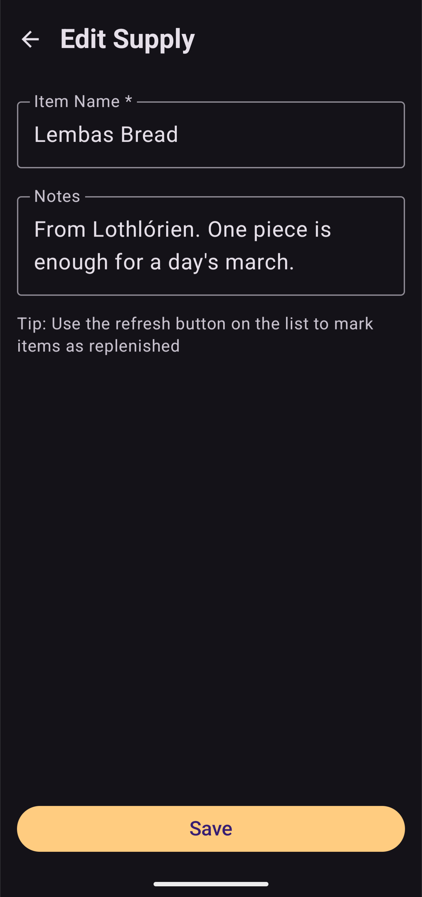

### Security Codes
Securely store access codes for facility doors, rooms, and cabinets.

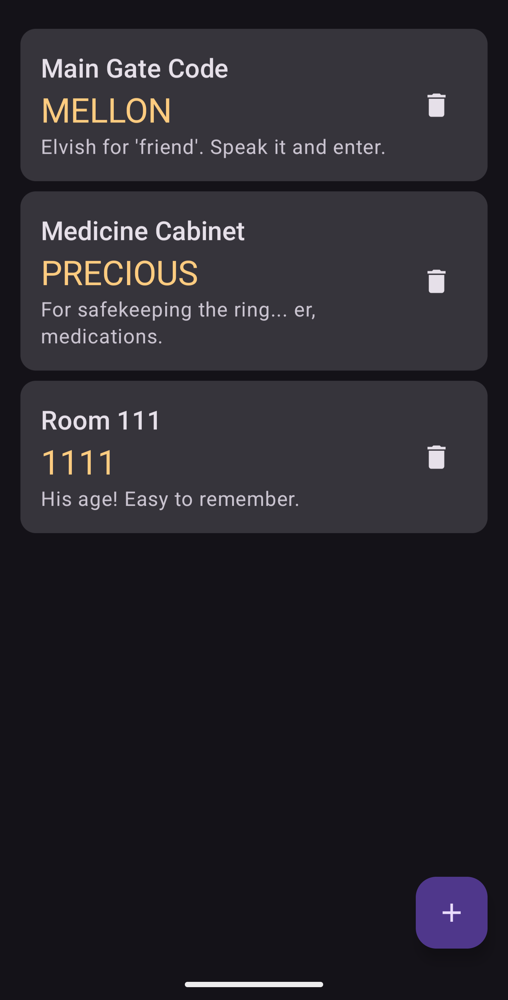


### Profile Management
Edit profile information including name, photo, notes, and room details.

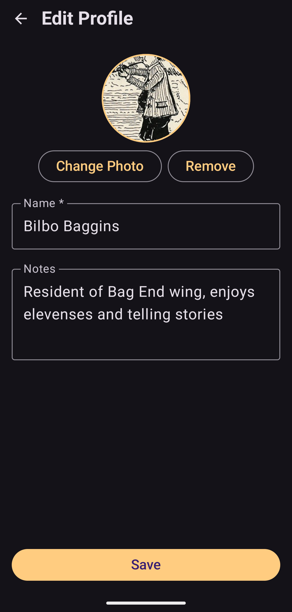

## Future Enhancements

See `FEATURE_IDEAS.md` for detailed planning and priorities.

### Under Consideration
- **Meal/Menu Tracking** - Import facility menus, track meals eaten together
- **Calendar Coordination** - Shared calendaring for family members coordinating visits
- **Social/Community Features** - Optional message boards for caregivers at same facility
- **Search functionality** - Search across all data
- **Export/Share functionality** - PDF, text export
- **Enhanced appointment reminders** - WorkManager notifications

## Package Structure

```
com.billybobbain.wellnest/
├── data/                     # Database entities and DAOs
│   ├── Profile.kt
│   ├── Medication.kt
│   ├── Appointment.kt
│   ├── Contact.kt
│   ├── HealthProfile.kt
│   ├── InsuranceProvider.kt
│   ├── InsurancePolicy.kt
│   ├── SecurityCode.kt
│   ├── Supply.kt
│   ├── Message.kt
│   ├── Settings.kt
│   ├── WellnestDao.kt
│   ├── WellnestDatabase.kt
│   └── WellnestRepository.kt
├── ui/
│   ├── screens/              # All screen composables
│   │   ├── MessagesScreen.kt
│   │   ├── AddEditMessageScreen.kt
│   │   ├── SettingsScreen.kt
│   │   └── ...
│   └── theme/                # Theme, Color, Type definitions
├── utils/                    # Utility classes
│   ├── ImageUtils.kt
│   ├── MedicationImporter.kt # CSV and JSON medication import
│   ├── ClaudeApiService.kt   # AI services (message clarification, photo import)
│   └── EncryptedPrefsManager.kt  # Secure API key storage
├── MainActivity.kt
├── WellnestApp.kt           # Navigation setup
├── WellnestViewModel.kt     # Main ViewModel
└── Navigation.kt            # Screen routes

```

## Notes

- Database uses explicit migrations to preserve user data across schema changes
- All phone numbers, addresses, and personal information are stored locally on device
- No cloud sync or backup - all data is local only
- Profile photos and insurance card images stored in app-private storage
- **AI Features Privacy**: When using optional AI features (message clarification, medication photo import), only the relevant content and your API key are sent to Claude API. No other personal information is transmitted. Your API key is stored encrypted using hardware-backed AES256-GCM encryption.

## Icon

The app features a custom nest+heart launcher icon representing the caring and nurturing nature of the application.

---

Built with ❤️ to help families care for their loved ones.
